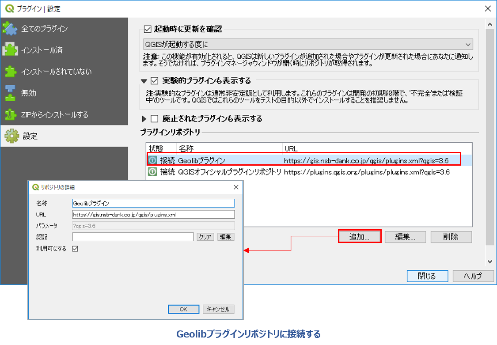

# II. 地質図リツールプラグインの導入・設定

「地質図ツール」プラグインがインストールされている場合は、メニューバーに「地質図ツール」メニューおよびツールバーが表示されます。  
ここから「地質図ツール」を使用できます。   

## 1.	プラグインのインストール

メニューに「地質図ツール」メニューが表示されていない場合は、プラグインのインストールがされていませんので、以下の方法でインストールを行います。
「地質図ツール」プラグインは、実験的なプラグインで公式プラグインではないため、下記のように専用リポジトリまたはZIPファイルアーカイブからインストールします。  
専用リポジトリからのプラグインのインストール手順は以下の通りです。

① QGISを起動して、 **[プラグイン]-[プラグインの管理とインストール...]**  をクリックします。  

 

② 「 設定」タブをクリックして「プラグインリポジトリ」に地学ライブラリツールプラグインのリポジトリを以下のように設定して接続します。    
    * 名称：「Geolibプラグイン」と入力  
    * URL：「https://gis.nsb-dank.co.jp/qgis/plugins.xml」  
    

③ 「全てのプラグイン」または「インストールされていない」タブで、「地質図ツール」を選択して **[インストール]**  をクリックしてプラグインをインストールします。

  

プラグイン管理ダイアログで、プラグイン名の右のチェックがついているものは、現在のQGIS上で動作しているプラグインです。  
インストール済のプラグインの一覧からチェックのON、OFFを行うことで、現在動作しているQGIS上でのプラグインの動作を制御することができます。

## 2.	プラグインのアップデート

プラグインの新しいバージョンがリリースされている場合は、プラグイン管理ダイアログで	「アップグレード可能]タブが表示されます。  
アップグレードを行うプラグインを選択して **[プラグインをアップグレード]** ボタンをクリックすると、選択したプラグインがアップグレードされます。

> QGISのインストール環境によってプラグインのインストール先や、後述するオプション設定を記録したファイルのパスが異なります。  
> 公式サイトからダウンロードしてWindows PCのハードディスクにQGISをインストールした場合は、プラグインパスは  
> 「C:\Users\(ユーザー名)\AppData\Roaming\QGIS\QGIS3\profiles\default\python\」  
> のようにユーザーフォルダの配下になります。  
> ポータブルタイプ（USB等の外部メモリから起動できるようにしたもの）のQGISの場合は、  
> 「(USBメモリのQGISフォルダ)\qgisconfig\profiles\default\python\plugins」  
> のように、USBメモリ内にプラグインがインストールされるように設定されます。  
> 設定したパスを確認したい場合は、メニューバー **[設定]-[ユーザープロファイル]-[アクティブなプロファイルフォルダを開く]**  で確認することができます。
