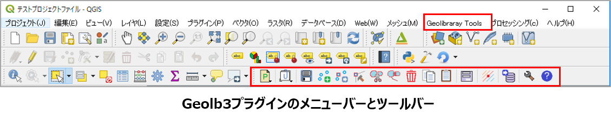
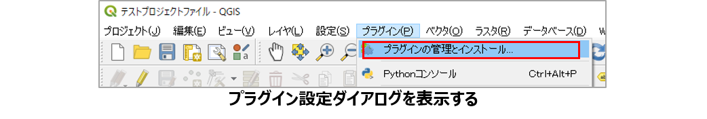
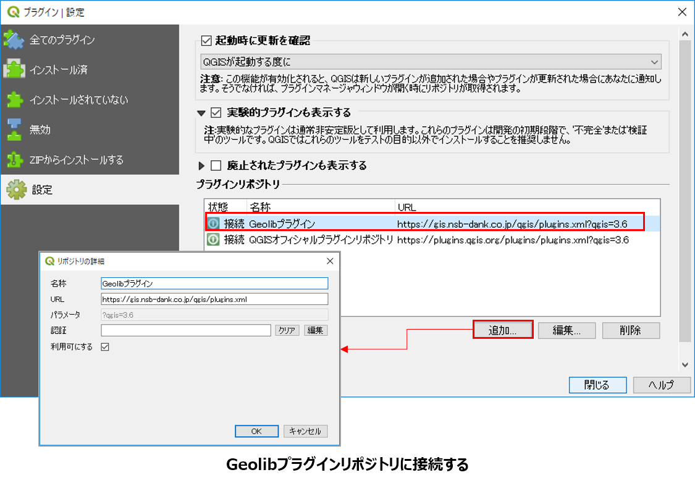

# II.	地学ライブラリツールプラグインの導入・設定

「地学ライブラリツール」プラグインがインストールされている場合は、メニューバーに「地学ライブラリツール」メニューおよびツールバーが表示されます。  
ここから「地学ライブラリツール」を使用できます。   

## 1.	プラグインのインストール

メニューに「地学ライブラリツール」メニューが表示されていない場合は、プラグインのインストールがされていませんので、以下の方法でインストールを行います。
「地学ライブラリツール」プラグインは、まだ実験的なプラグインで公式プラグインではないため、下記のように専用リポジトリまたはZIPファイルアーカイブからインストールします。  
専用リポジトリからのプラグインのインストール手順は以下の通りです。

①	QGISを起動して、 **[プラグイン]-[プラグインの管理とインストール...]**  をクリックします。  

 

②	「ZIPからインストールする」タブをクリックして「ZIPファイル」に地学ライブラリツールプラグインのアーカイブファイル（geolib.zip）を指定して [プラグインをインストール] をクリックします。  

⇩ 「インストール済」タブを開くと「地学ライブラリツール」がインストールされています。

プラグイン管理ダイアログで、プラグイン名の右のチェックがついているものは、現在のQGIS上で動作しているプラグインです。インストール済のプラグインの一覧からチェックのON、OFFを行うことで、現在動作しているQGIS上でのプラグインの動作を制御することができます。

## 2.	プラグインのアップデート

プラグインの新しいバージョンがリリースされている場合は、以下の手順でアップグレードを行います。
①	[プラグイン]-[プラグインの管理とインストール...] をクリックします。
⇩ プラグイン管理ダイアログが表示されます。

②	「アップグレード可能]タブをクリックすると、新しいバージョンがリリースされているプラグインが表示されます。
③	アップグレードを行うプラグインを選択します。
④	[プラグインをアップグレード]ボタンをクリックすると、選択したプラグインがアップグレードされます。

QGISのインストール環境によってプラグインのインストール先や、後述するオプション設定を記録したファイルのパスが異なります。
公式サイトからダウンロードしてWindows PCのハードディスクにQGISをインストールした場合は、プラグインパスは
「C:\Users\(ユーザー名) \AppData \Roaming \QGIS \QGIS3 \profiles \default \python\」
のようにユーザーフォルダの配下になります。
ポータブルタイプ（USB等の外部メモリから起動できるようにしたもの）のQGISの場合は、
「(USBメモリのQGISフォルダ) \qgisconfig \profiles \default \python \plugins」
のように、USBメモリ内にプラグインがインストールされるように設定されます。
設定したパスを確認したい場合は、メニューバー[設定]-[ユーザープロファイル]-[Open Active Profile Folder]で確認することができます。

