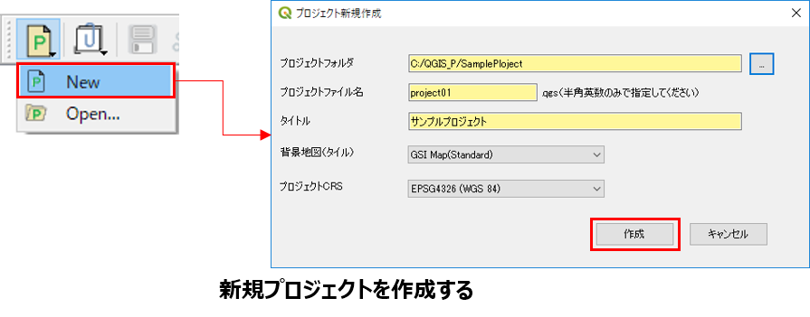
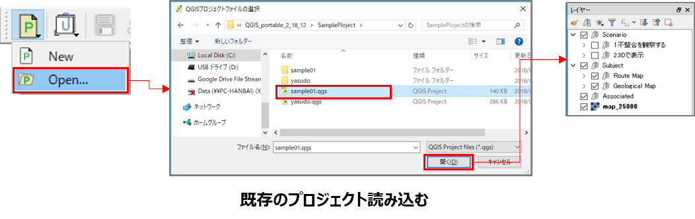
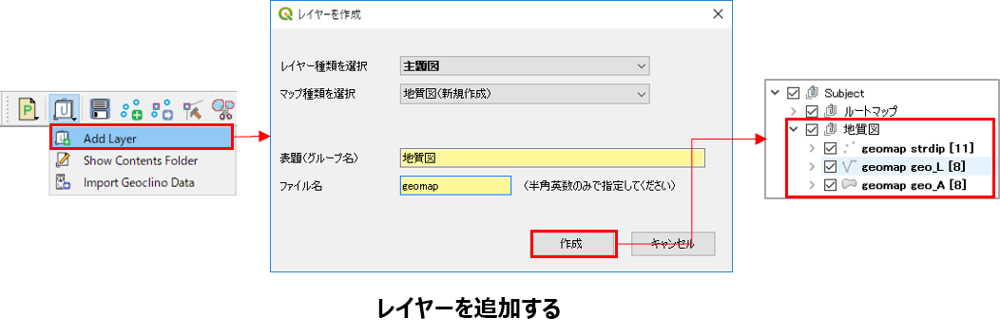
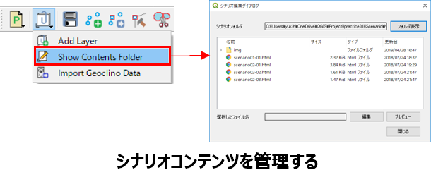
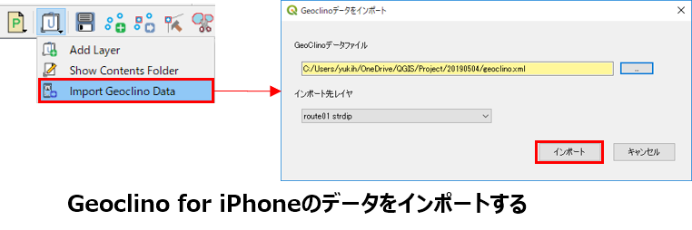

# IV. 地学ライブラリツールの機能

地学ライブラリツールのメニューまたはツールバーから以下の各機能を使用することができます。  

## プロジェクトツール [Project Tool]  

### 新規プロジェクト [New]  

地学ライブラリ用のプロジェクトファイルおよびフォルダを作成します。  
> 標準メニューの[プロジェクト]-[新規]からプロジェクトファイルを作成すると、地学ライブラリ用フォルダ等が作成されませんので、「地学ライブラリ」用の地図を作成する場合は、必ず本メニューからプロジェクトを作成してください。  

  

①  メニューまたはツールバーで、**[Project Tool]-[New]** をクリックします。  
② プロジェクト作成ダイアログで以下の項目を入力して **[作成]** をクリックします。  
    * **プロジェクトフォルダ**：ここで指定したフォルダの配下に、必要な各種ファイルが作成されます。  
    * **プロジェクトファイル名**：プロジェクト定義ファイル（拡張子：.qgsのファイル）名称です。拡張子は付けずに指定します。  
    *  **タイトル**：プロジェクトを開いているときにQGISのヘッダに表示される名称です。わかりやすい名称を指定してください。  
    *  **背景地図**：背景となる地図には、国土地理院が配信している電子地図を使用しています。通常は「GSI Map(Standard)」を選択してください。  
    * **プロジェクトCRS**：通常は「EPSG4326（WGS 84）」を選択してください。  

地学ライブラリ作成用の各種レイヤグループが作成され、レイヤパネルに表示されます。また、プロジェクトフォルダにレイヤーデータを格納するサブフォルダが作成されます。

> ※背景地図はインターネットに接続した状態でないと使用できません。  
> 地学ライブラリプラグインでは、座標系（CRS）はWGS84（EPSG:4326）またはJGD2000（EPSG4612）を使用します。  
> 利用する地図の座標系に応じて設定を変更したい場合は、プロジェクトプロパティを開いて変更してください。

### プロジェクトを開く [Open...]   

既に作成しているプロジェクトファイルを呼び出します。（標準メニューの[プロジェクト]-[開く...] と同機能です）

  

①  メニューまたはツールバーで、**[Project Tool]-[Open...]** をクリックします。  
② ファイル選択ダイアログが表示されたら、プロジェクトファイル（拡張子：.qgs）を選択して、**[開く]**  をクリックします。  
 レイヤがロードされ、レイヤパネルに表示されます。  

## レイヤーツール [Layer Tool]  

### レイヤー作成 [Add Layer]  

シナリオまたは主題図を作成するためのレイヤを作成します。  

  

① メニューまたはツールバーで **[Layer Tool]-[Add Layer]** をクリックします。  
② レイヤ作成ダイアログが表示されたら、以下の項目を指定して **[作成]**  ボタンをクリックします。  
    * **レイヤー種類** ：指定した種類に応じてレイヤーグループ（Scenario/Subject/Associatedのいずれか）が作成されます。  
    * **マップ種類** ：レイヤー種類に応じて、作成できるマップが表示されるので選択します。  
    * **表題（グループ名）**：指定したレイヤー種類の配下に、このグループ名でレイヤーが作成されます。  
    * **ファイル名**：この名称でプロジェクトフォルダ内にサブフォルダとファイルが作成されます。  

> マップ種類で「既存ファイルのインポート」を選択すると、ファイル選択を行う欄が表示されます。ここに別のプロジェクトで作成したレイヤーのファイルを指定すると、既存のレイヤーをこのプロジェクトに取り込むことができます。  
> ただし、スタイルなどは正しく取り込めませんので、取り込んだ後に修正してください。

レイヤグループとレイヤが作成され、レイヤパネルに表示されます。

### シナリオコンテンツ編集 [Show  Contents Folder]   

シナリオにリンクするコンテンツ（HTML文書、PDF、画像等）のフォルダ内容の閲覧と管理を行います。  

  

① メニューまたはツールバーの **[Layer Tool]-[Show Contents Folder]** をクリックします。  
② シナリオコンテンツ編集ダイアログで、コンテンツを管理しているフォルダ（[プロジェクトフォルダ]\Scenario\html\）のファイル一覧が表示ます。  
   シナリオマップの地物にリンクするコンテンツはすべてこのフォルダの中に格納するようにしてください。  
> このダイアログではファイル内容の編集や追加は行えませんので、ファイルやフォルダの追加・編集・削除を行いたい場合は、**[フォルダ表示]** 
をクリックしてエクスプローラをの機能にて行ってください。  

### GeoClinoデータインポート [Import Geoclino Data]  

GeoClinoの観測データ（XMLファイル）を地質図マップのstrdipレイヤの地物としてインポートします。  

  

① メニューまたはツールバーの  **[Layer Tool]-[Import Geoclino Data]** をクリックします。  
② GeoClinoデータのインポートダイアログが表示されたら、 **[ ... ]** をクリックして、GeoClinoデータが格納されているXMLファイルを指定します。  
③   インポート先レイヤを選択して **[インポート]** をクリックします。  

指定したstrdip(走向・傾斜)レイヤにGeoClonoデータがインポートされます。

## 編集ツール [Editing Tool]  

編集ツールで、各地図キャンバスの地物の追加・編集を行ないます。
レイヤパネルで編集を行いたいレイヤを選択したうえで、ツールバーの各ボタンをクリックして地物の編集を行います。

### レイヤ保存：選択しているレイヤの地物のスタイル表示を最新化します。
### 地物の追加：ONにすると、選択しているレイヤの地物追加モードにします。
### 地物の移動：ONにすると、選択しているレイヤの地物移動モードにします。
### ノード編集：ONにすると、選択しているレイヤのノード編集モードにします。
### 地物の分割：ONにすると、選択しているレイヤの地物分割モードにします。
### 地物の結合：複数の地物を一つに結合します。
### 地物の削除：選択している地物を削除します。
### 地物のコピー：選択した地物をクリップボードにコピーします。
### 地物の貼り付け：クリップボードにある地物を選択しているレイヤに貼り付けます。  

①   レイヤ保存：選択しているレイヤの地物のスタイル表示を最新化します。
②   属性編集：地物を選択してこのボタンをクリックすると、選択した図形の属性を編集するダイアログが表示されます。
③   地物の追加：このボタンがONのとき、地図キャンバスをクリックすると新たな図形が追加されます。（ラインやポリゴンの場合は、左クリックを連続して線を描画して、右クリックで終了します）
④   地物の移動：このボタンがONのときは、図形を選択して一括で移動が行えます。
⑤   ノード編集：このボタンがONときは、図形の頂点を選択して移動させることにより、図形の変形が行えます。
⑥   地物の分割：このボタンがONのとき、地図キャンバスで線を引くと、その線の両側で図形が分割されます。
⑦   地物の結合：2つ以上の図形を選択した状態でこのボタンをクリックすると、その図形が結合されます。同じ性質を持つ図形の属性を一致させるときに使用します。
⑧   地物の削除：選択している地物を削除します。複数の地物を選択して一括で削除することができます。
⑨   走向線描画：観測地点の走向・傾斜データをもとに地質境界線を描画する際に、補助走向線を表示することができます。走向・傾斜データを一つ選択した状態で[走向線の描画]をクリックすると、走向線が表示されます。もういちどこのボタンをクリックすると、走向線は消えます。（走向線の本数や間隔、色などは、[設定(Settings)]の「地質図設定で」変更することができます）
⑩   地物のコピー：選択した地物をクリップボードにコピーします。
⑪   地物の貼り付け：クリップボードにある地物を別のレイヤ（同じ種類のレイヤのみ）に貼り付けます。

### 属性編集：選択している地物の属性を編集します。  

### 走向線描画：選択した走向・傾斜をもとに走向線を描画します。  

### Webライブラリにエクスポート：QGISで作成したマップデータをWebライブラリへエクスポートします。  

### 設定	：各種設定ダイアログを表示します。  

このプラグインの各種設定を行います。

①   [設定]ボタンをクリックします。
⇩ 地学ライブラリツール設定ダイアログが表示されます。
②   以下の各設定を行い[OK]をクリックします。

「プロジェクト設定」タブ
HTMLエディタ：シナリオコンテンツのHTMK文書を編集するソフトウエアの実行パスを指定します。

「地質図設定」タブ
走向線の等高間隔、線の長さ、線の数、線の太さ、線の色（基準、高位、低位）を設定します。

「地学ライブラリ設定」タブ
地学ライブラリサーバーの接続情報を設定します。パスワードは、Web地学ライブラリにログインしてユーザ情報を表示し、そこに記載されているパスワードを指定してください。

### ヘルプ：このファイルを表示します。  
