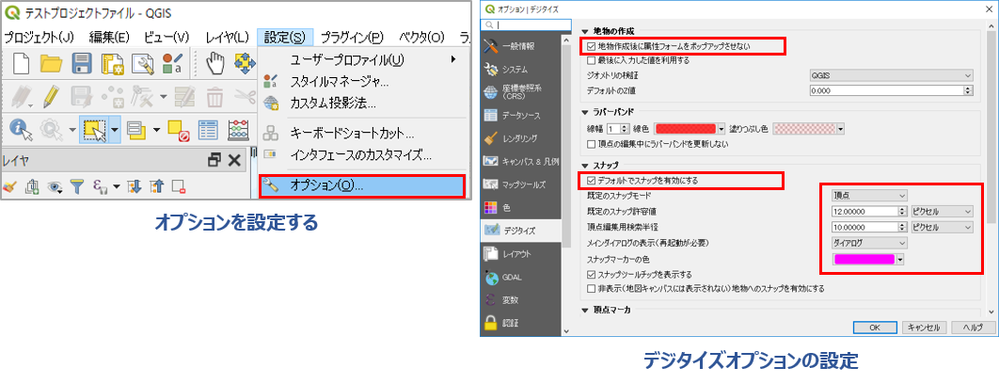
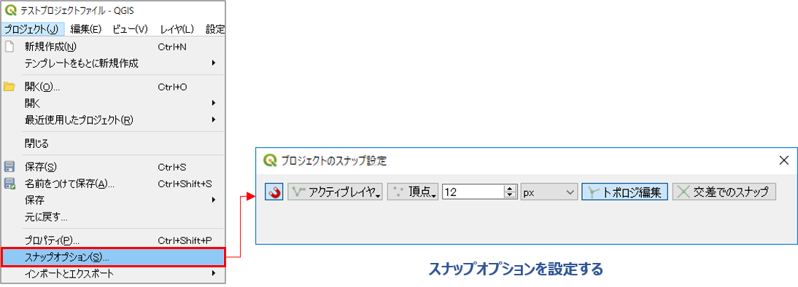

# Ⅲ. オプションの設定

地学ライブラリツールプラグインを使用するにあたっては、以下の設定にしておくことを推奨します。  
また、オプションの設定を行ったら、一度QGISを再起動させておいた方がよいでしょう。  

## デジタイズオプションを設定する  

オプション設定でQGISの起動時の表示やさまざまな動作の設定を、ご自身で使いやすいようにカスタマイズすることができます。  
ここでは、ルートマップや地質図の作成・編集時の動作として、「デジタイズ」のオプションを設定しておきます。  

  

①	メニューバーの **[設定]-[オプション...]** を選択します。  
②	「デジタイズ」タブをクリックし、「地物の作成」で地物作成後に属性フォームをポップアップさせないに チェックします。  
③	その他のデジタイズの設定（スナップや頂点マーカのスタイルなど）を作成する地図によって調整します。地学ライブラリツールを使用する場合は、「デジタイズ」タブの「スナップ」では以下の数値くらいで設定しておいた方がよいでしょう。  
    - 既定のスナップモード ： 頂点  
    - 既定のスナップ許容値：　15.00000 ピクセル程度  
    - 頂点編集用検索範囲：　10.00000 ピクセル程度  
④	［OK］ボタンをクリックしてオプションダイアログを閉じます。  

## スナップオプションを設定する  
スナップとは、図形の編集中にマウス近傍にあるほかの図形に吸い付くように描画できる機能のことです。  
既定のスナップ設定は上記の[設定]-[オプション]で行いましたが、地図の作成中に描画しずらいようであれば以下のようにスナップ設定を変更してください。

  

①	メニューバーの **[プロジェクト]-[スナップオプション...]** を選択します。  
②	以下の設定を行います。  
    - スナップ（マグネットのアイコン）：有効にします  
    - レイヤ選択：[アクティブレイヤ]  
    - スナップ先：“頂点”  
    - 許容範囲：作成する地図の細かさに合わせて調整する（ 12 px程度）  
    - トポロジ編集：有効にします  

※ このスナップオプションの設定は、必要に応じて地図の作成が行いやすいように変更できます。  
設定が終了したら、 **[x]** ボタンをクリックしてスナップオプションダイアログを閉じます。  

